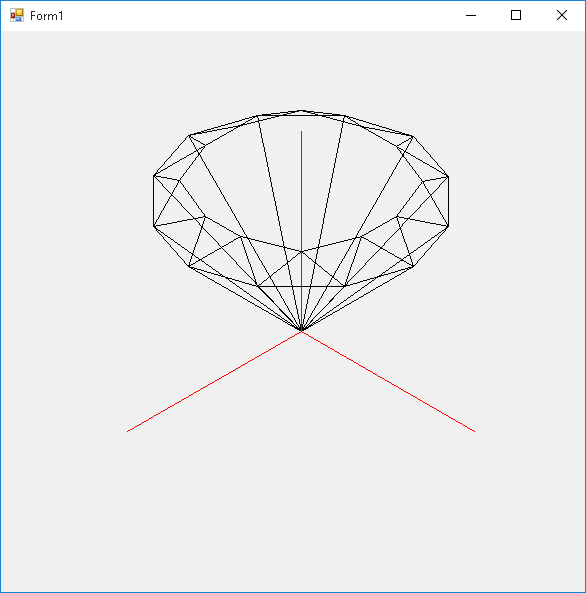
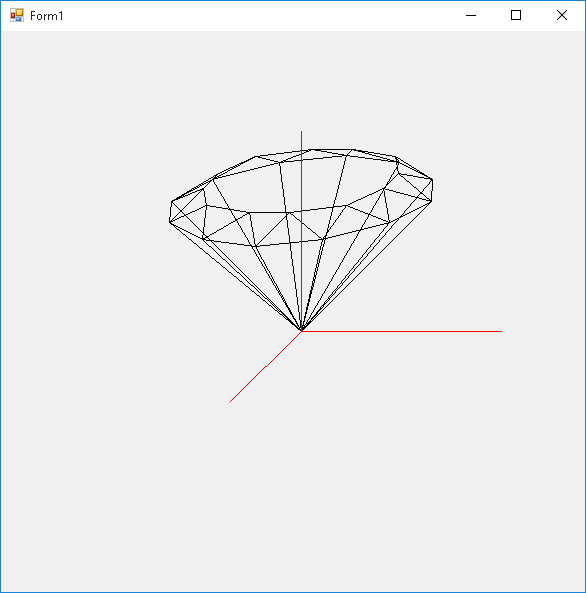
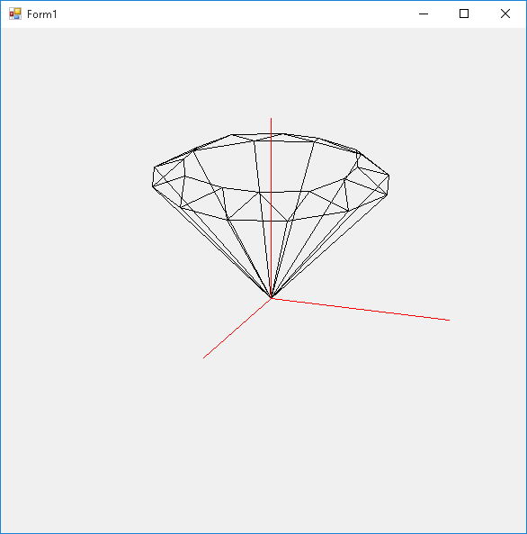

Axonometric projection
======================

Introduction
------------

An [axonometric projection](https://en.wikipedia.org/wiki/Axonometric_projection) is a drawing method for 3D objects into a 2D plane. Although it looks unnatural (distant objects are of the same size of near ones), it's the method of choice for technical drawings and it's very efficient (the coefficients are constants and can be precalculated, therefore projecting a point requires only six multiplications and two summations).
The three axes are mapped into any fraction of the 360° circle and each coordinate may or may not be scaled by a factor; although the choice is free, there are some standard projections (angles are referred to the screen's x axis, i.e. the horizontal line from left to right):

- Isometric: x angle: 210°, y angle: 330°, z angle: 90°, axes ratio: 1:1:1
- Engineer: x angle: 222°, y angle: 353°, z angle: 90°, axes ratio: 0.5:1:1
- Cavalier: x angle: any (usually 225°), y angle: 0°, z angle: 90°, axes ratio any:1:1 (x scale is usually 1 or 0.5)
- Bird's eye: x angle: any, y angle: x angle + 90°, z angle: 90°, axes ratio any:any:any (z scale is usually 2/3 = 0.66)
- Military: same as bird's eye, but z scale is always 1.

The following are screenshots of three different projections of the same diamond:

Features
--------

This program in C# implements an `AxonometricPoint` class which calculates and stores the projection's coefficient during instantiation and allows to transform the 3D point with any transformation matrix (the 2D projection is simply a "view" on the 3D coordinates, which act as a "model", so the 3D point can be transformed and reprojected without information loss).

A demo shows a [wireframe](https://en.wikipedia.org/wiki/Wire-frame_model) diamond rotating along the z axis and moving in a circle on the xy plane inside a double buffered Windows Form.

The wireframe is implemented with the naive algorithm:

- a vertex list stores the coordinates for each vertex
- an edge list stores which vertexes are connected
- any geometric transformation is applied only to the vertex list
- a line is drawn for each entry of the edge list, from the first vertex to the second vertex (no hidden line removal algorithm is implemented).

Remarks
-------

- Although any `AxonometricPoint` instance represents a single point and its transformations are therefore intrinsecally independent from other points, the demonstration code is not parallelized
- The form is drawn with high level methods, and therefore is not particularly fast
- Since this solution serves the purpose of demonstrating the `AxonometricPoint` class' features, no class encapsulating a 3D figure was created (the diamond figure is entirely handled by the form).